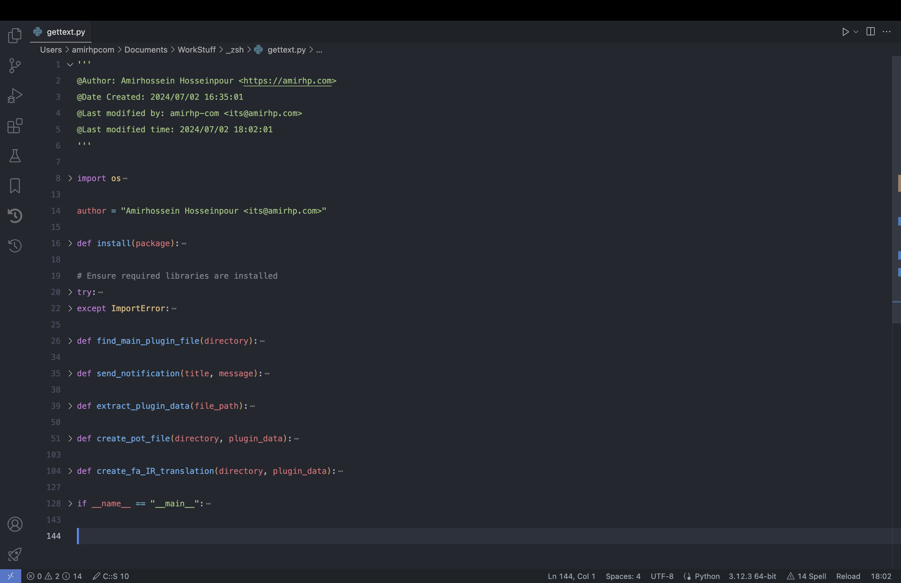
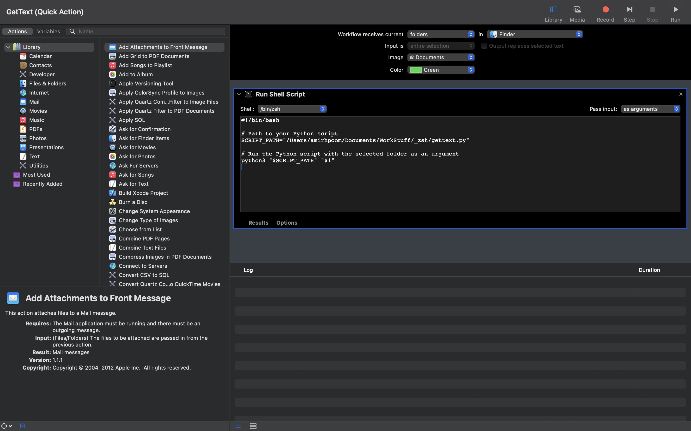
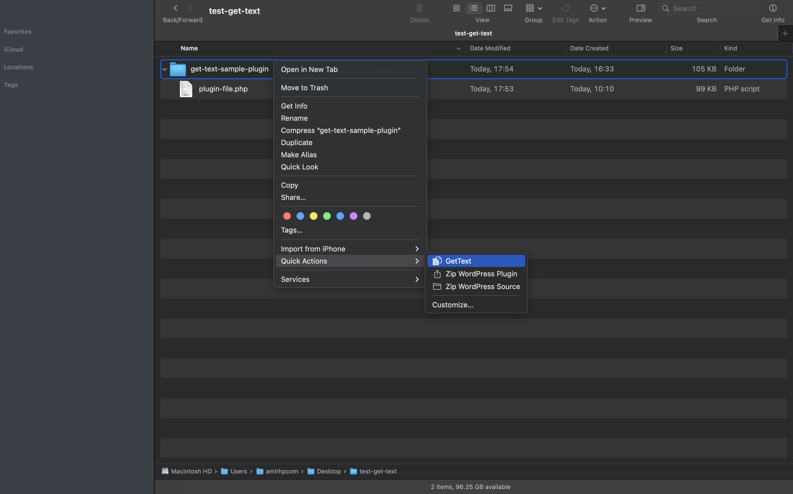
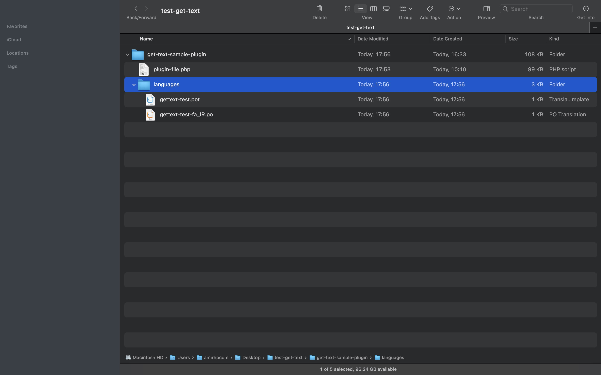

# WPTransGen

WPTransGen is a tool designed to simplify the creation of translation files for WordPress plugins. It generates `.pot` files and `.po` files for the `fa_IR` locale based on the WordPress plugin's main file. You can Update translation strings later using PoEdit.

**Developed by [Amirhp.Com](https://Amirhp.Com/)** 🦖

## Features

- Automatically finds the main plugin file.
- Extracts plugin data to populate translation metadata.
- Generates `.pot` and `fa_IR.po` translation files.
- Sends a macOS notification upon completion.

## Requirements

- Python 3.x
- macOS

## Installation

1. **Clone the repository**:

   ```sh
   git clone https://github.com/amirhp-com/WPTransGen.git
   cd WPTransGen
   ```

2. Save the Python script:

   Ensure **gettext.py** is located in a suitable directory, e.g., ~/scripts/gettext.py.

3. Create Automator Quick Action:

   - Open Automator and create a new Quick Action.

   - Configure it to receive current folders in Finder.

   - Add a "Run Shell Script" action with the following script:

   - Set pass input: as arguments

   ```shell
   #!/bin/zsh

   # Path to your Python script
   SCRIPT_PATH="~/scripts/gettext.py"

   # Run the Python script with the selected folder as an argument
   python3 "$SCRIPT_PATH" "$1"
   ```

   - Save as "Make Translations" or give it another name

4. Run the Quick Action:

   - Right-click on the folder containing the WordPress plugin.

   - Select "Make Translations" from the Quick Actions menu.

## Screenshots
| Shot 1 | Shot 2 | Shot 3 | Shot 4 |
| :---:  | :---:  | :---:  | :---:  |
|||||

## License

This project is licensed under the MIT License.

Copyright 2024 Amirhossein Hosseinpour (Amirhp.Com)

Permission is hereby granted, free of charge, to any person obtaining a copy of this software and associated documentation files (the “Software”), to deal in the Software without restriction, including without limitation the rights to use, copy, modify, merge, publish, distribute, sublicense, and/or sell copies of the Software, and to permit persons to whom the Software is furnished to do so, subject to the following conditions:

The above copyright notice and this permission notice shall be included in all copies or substantial portions of the Software.

THE SOFTWARE IS PROVIDED “AS IS”, WITHOUT WARRANTY OF ANY KIND, EXPRESS OR IMPLIED, INCLUDING BUT NOT LIMITED TO THE WARRANTIES OF MERCHANTABILITY, FITNESS FOR A PARTICULAR PURPOSE AND NONINFRINGEMENT. IN NO EVENT SHALL THE AUTHORS OR COPYRIGHT HOLDERS BE LIABLE FOR ANY CLAIM, DAMAGES OR OTHER LIABILITY, WHETHER IN AN ACTION OF CONTRACT, TORT OR OTHERWISE, ARISING FROM, OUT OF OR IN CONNECTION WITH THE SOFTWARE OR THE USE OR OTHER DEALINGS IN THE SOFTWARE.
